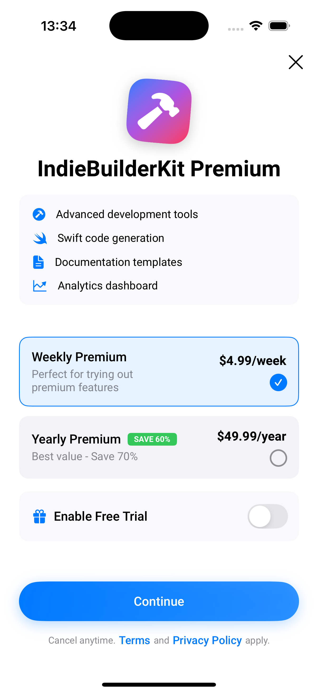
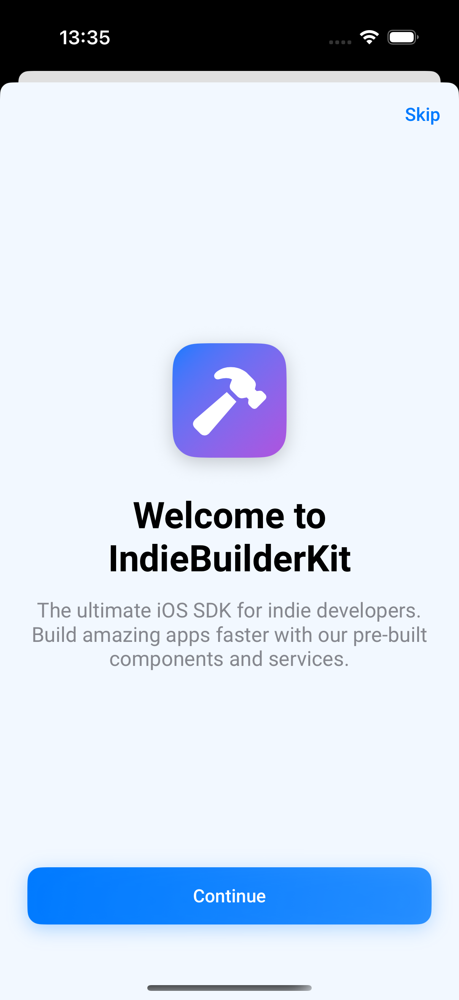
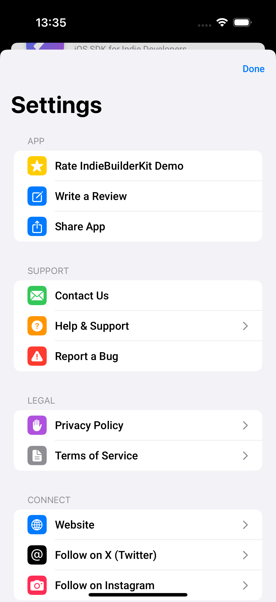
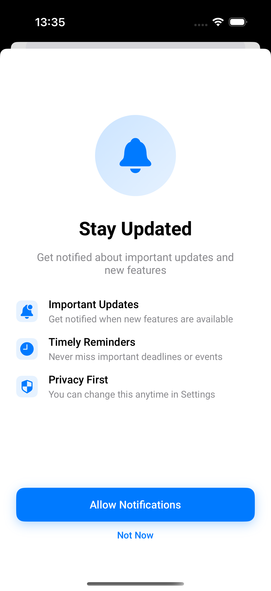
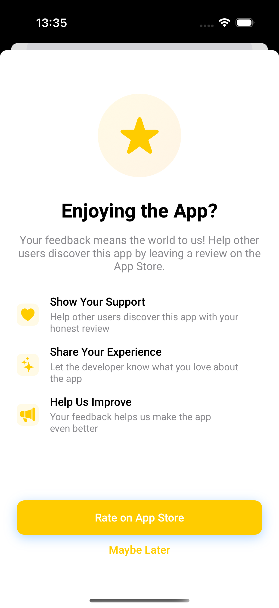
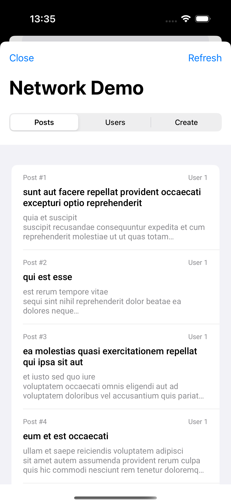
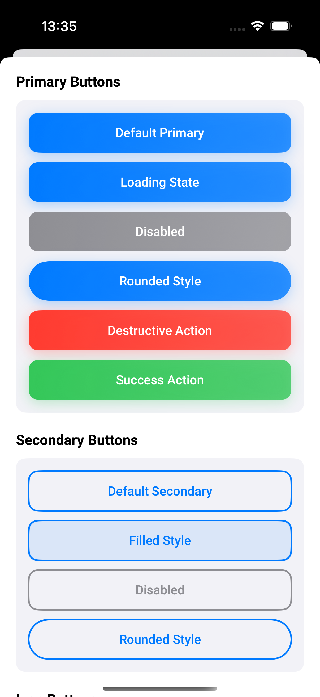
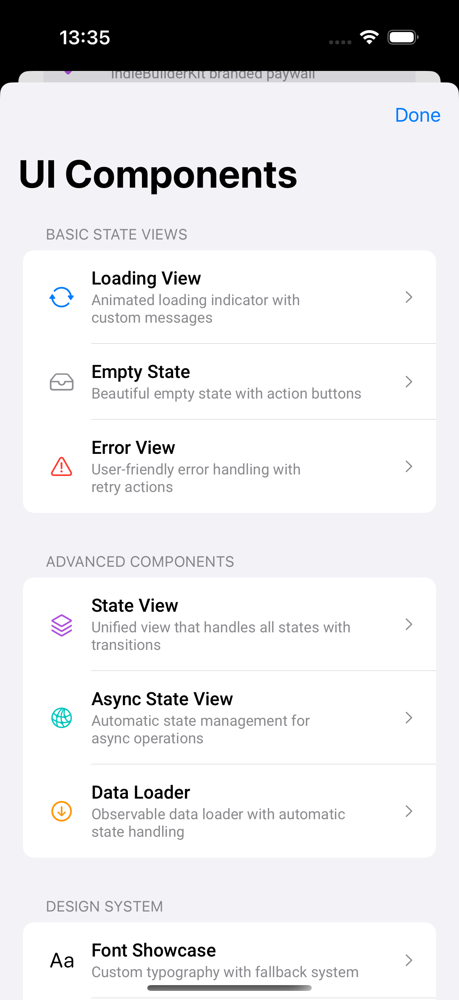

**IndieBuilderKit**

[](https://swift.org)
[](https://developer.apple.com/ios/)
[](LICENSE)
[](https://swift.org/package-manager/)

A simple iOS toolkit for indie developers. Start your app faster with essential components, subscriptions, and analytics.

## Quick Start

### Installation
Add to your project with Swift Package Manager:

```swift
dependencies: [
    .package(url: "https://github.com/gokhanamal/IndieBuilderKit", from: "1.0.0")
]
```

### Basic Setup
```swift
import IndieBuilderKit
import SwiftUI

@main
struct MyApp: App {
    var body: some Scene {
        WindowGroup {
            ContentView()
                .task {
                    // Register custom fonts
                    IndieBuilderKit.registerCustomFonts()
                }
        }
    }
}
```

## Visual Showcase

<table>
<tr>
<td align="center">
<br>
<sub><b>Paywall</b></sub>
</td>
<td align="center">
<br>
<sub><b>Onboarding</b></sub>
</td>
<td align="center">
<br>
<sub><b>Settings</b></sub>
</td>
</tr>
<tr>
<td align="center">
<br>
<sub><b>Notification Permission</b></sub>
</td>
<td align="center">
<br>
<sub><b>Rating Request</b></sub>
</td>
<td align="center">
<br>
<sub><b>Network Demo</b></sub>
</td>
</tr>
<tr>
<td align="center">
<br>
<sub><b>Button Components</b></sub>
</td>
<td align="center">
<br>
<sub><b>UI Components</b></sub>
</td>
<td align="center">
</td>
</tr>
</table>

## Why IndieBuilderKit?

Building an iOS app as an indie developer means handling subscriptions, analytics, UI components, and notifications—all before writing your core features. IndieBuilderKit gives you these essential building blocks so you can focus on what makes your app unique.

**Key Benefits:**
- 🚀 **Ship faster** - Pre-built components save weeks of development
- 💰 **Revenue ready** - Complete subscription system with RevenueCat integration
- 🎨 **Native feel** - SwiftUI components that follow iOS design guidelines
- 🔧 **Flexible** - Use what you need, customize everything else
- 📱 **Modern** - Built with Swift 6, async/await, and @Observable

## Demo App

Check out the demo app in `Demo/IndieBuilderKitDemo.xcworkspace` to see all components in action.

## Feature Overview

| Component | Description | Key Features |
|-----------|-------------|--------------|
| 💳 **PaywallView** | Beautiful subscription paywall | Custom images, localization, RevenueCat integration |
| 📊 **Analytics** | Clean analytics abstraction | Multi-provider support, consistent API |
| 🎨 **UI Components** | Ready-to-use SwiftUI views | Onboarding, settings, loading states, beautiful buttons |
| 🔔 **Permissions** | Notification permission handling | User-friendly prompts, status tracking |
| ⭐ **RatingView** | App Store review requests | Customizable benefits, native integration |
| 🌐 **NetworkService** | Modern HTTP networking | Swift Concurrency, comprehensive error handling |
| ⚙️ **Utilities** | Essential app services | Contact handling, fonts, app ratings |

## Features & Usage

### ✨ Paywall & Subscriptions
Beautiful subscription paywall with complete subscription management. One service handles everything from UI state to purchases.


```swift
// Simple paywall with mock service (for testing/prototyping)
PaywallView()

// With custom configuration
PaywallView(configuration: PaywallConfiguration(
    title: "Unlock Premium",
    subtitle: "Get access to all features",
    image: .crown, // Use built-in crown icon
    features: [
        PaywallFeature(iconName: "checkmark.circle.fill", title: "Unlimited exports"),
        PaywallFeature(iconName: "cloud.fill", title: "Cloud sync"),
        PaywallFeature(iconName: "star.fill", title: "Premium templates"),
        PaywallFeature(iconName: "bell.slash.fill", title: "No ads")
    ]
))

// With system icon (SF Symbols)
PaywallView(configuration: PaywallConfiguration(
    title: "Go Premium",
    image: .systemIcon("star.fill")
))

// With bundle image
PaywallView(configuration: PaywallConfiguration(
    title: "Unlock Features",
    image: .bundleImage("app-logo")
))

// With custom image
PaywallView(configuration: PaywallConfiguration(
    title: "Premium Access",
    image: .customImage(Image("custom-paywall-hero"))
))

// With localized strings (supports NSLocalizedString)
PaywallView(configuration: PaywallConfiguration.localized(
    title: NSLocalizedString("unlock_premium", value: "Unlock Premium", comment: ""),
    subtitle: NSLocalizedString("premium_subtitle", value: "Get access to all features", comment: ""),
    strings: PaywallStrings.localized(
        continueText: NSLocalizedString("continue_button", value: "Continue", comment: ""),
        termsURL: "https://yourapp.com/terms",
        privacyPolicyURL: "https://yourapp.com/privacy"
    )
))

// Custom strings for branding
PaywallView(configuration: PaywallConfiguration(
    title: "Go Pro",
    strings: PaywallStrings(
        processingText: "Please wait...",
        selectPlanText: "Choose Your Plan",
        startFreeTrialText: "Try Free for 7 Days",
        continueText: "Subscribe Now",
        savingsText: "BEST VALUE",
        termsURL: "https://myapp.com/terms",
        privacyPolicyURL: "https://myapp.com/privacy"
    )
))

// Use RevenueCat (recommended for production)
let revenueCatService = RevenueCatSubscriptionService()
Task {
    await revenueCatService.configure(apiKey: "your-revenuecat-api-key")
}
PaywallView(service: revenueCatService)

// Or implement your own complete subscription service
@Observable
class MySubscriptionService: SubscriptionServiceProtocol {
    // Configuration
    var isConfigured = false
    
    // Subscription Management  
    var subscriptionStatus: SubscriptionStatus = .inactive
    
    // Paywall UI State
    var availablePlans: [SubscriptionPlan] = [/* your plans */]
    var selectedPlan: SubscriptionPlan?
    
    func configure(apiKey: String) async {
        // Setup your subscription backend
        isConfigured = true
    }
    
    func refreshSubscriptionStatus() async {
        // Check current subscription status
    }
    
    func hasEntitlement(_ entitlementId: String) -> Bool {
        return subscriptionStatus.isActive
    }
    
    func selectPlan(_ plan: SubscriptionPlan) {
        selectedPlan = plan
    }
    
    func purchaseSelectedPlan() async throws {
        // Your purchase logic (StoreKit, RevenueCat, etc.)
        // Throw SubscriptionServiceError.purchaseCancelled if cancelled
        // Throw SubscriptionServiceError.purchaseFailed(_) if failed
    }
    
    func restorePurchases() async throws {
        // Your restore logic
        // Throw SubscriptionServiceError.restoreFailed(_) if failed
    }
    
    func setUserId(_ userId: String?) { /* User management */ }
    func logOut() { /* Logout logic */ }
}

PaywallView(service: MySubscriptionService())
```

### 📊 Analytics Wrapper
Clean abstraction for analytics that works with any provider. Track events consistently without vendor lock-in.

```swift
// Setup with your analytics provider
let analytics = AnalyticsWrapper(providers: [
    FirebaseAnalyticsProvider(),
    AmplitudeProvider(),
    MockAnalyticsProvider() // For testing
])

// Track events
analytics.track(.screenView(name: "HomeScreen"))
analytics.track(.purchase(transactionId: "tx_123", value: 9.99))
analytics.track(.custom(name: "feature_used", parameters: ["feature": "export"]))

// User properties
analytics.setUserId("user_123")
analytics.setUserProperty("premium", forName: "subscription_status")
```

### 🎨 UI Components
Ready-to-use SwiftUI components for common app patterns. All follow modern iOS design guidelines with a comprehensive design system.

<table>
<tr>
<td></td>
<td></td>
</tr>
<tr>
<td></td>
<td></td>
</tr>
</table>

```swift
// Loading states
StateView(state: .loading) {
    // Your content here
}

// Settings screen with social links
SettingsView(
    socialLinks: [
        SocialLink(platform: .twitter, handle: "gokhanamal"),
        SocialLink(platform: .github, handle: "gokhanamal")
    ]
)

// Onboarding flow
OnboardingView(pages: [
    OnboardingPage(title: "Welcome", description: "Get started with our app")
])

// Error handling
ErrorView(
    title: "Something went wrong",
    message: "Please try again later",
    retryAction: { /* retry logic */ }
)

// Beautiful Button Components
PrimaryButton("Get Started") {
    // Action
}

PrimaryButton("Loading...", isLoading: true) { }

SecondaryButton("Learn More") {
    // Action
}

// Icon buttons
IconButton(icon: "heart.fill", title: "Like") { }
IconButton(icon: "share", style: .prominent) { }

// Floating action button
FloatingActionButton(icon: "plus") {
    // Add new item
}

// Chip buttons for filters/tags
HStack {
    ChipButton("All", isSelected: true) { }
    ChipButton("Favorites") { }
    ChipButton("Recent") { }
}

// Link buttons
LinkButton("Terms of Service", style: .underlined) { }
```

### 🔔 Notification Permissions & App Reviews
Handle notification permissions gracefully with user-friendly prompts and beautiful rating request views.

<table>
<tr>
<td></td>
<td></td>
<td></td>
</tr>
</table>

```swift
// Notification Permissions
let permissionManager = PermissionManager.shared

// Check notification permission status
if permissionManager.notificationStatus == .authorized {
    // Send notifications
}

// Request notification permission
await permissionManager.requestPermission(for: .notifications)

// Use in SwiftUI
@Environment(\.permissions) private var permissions

// Check if notifications are granted
if permissions.arePermissionsGranted([.notifications]) {
    // Handle notifications
}

// Open app settings if denied
permissions.openAppSettings()

// Custom notification permission view
NotificationPermissionView() // Default configuration

// Custom notification prompt
NotificationPermissionView(
    configuration: NotificationPermissionConfiguration.custom(
        title: "Stay Updated",
        subtitle: "Get notified about important updates",
        features: [
            NotificationFeature(icon: "bell.fill", title: "Breaking News"),
            NotificationFeature(icon: "star.fill", title: "New Features")
        ]
    )
)
```

### 🌐 Network Service
Modern networking with Swift Concurrency. Clean API for HTTP requests with proper error handling.

```swift
let networkService = NetworkService.shared

// GET request
let userProfile = try await networkService.get(
    url: URL(string: "https://api.example.com/users/123")!,
    headers: ["Authorization": "Bearer token"],
    responseType: UserProfile.self
)

// POST request with JSON body
let newPost = CreatePostRequest(title: "Hello", content: "World")
let createdPost = try await networkService.post(
    url: URL(string: "https://api.example.com/posts")!,
    body: newPost,
    responseType: Post.self
)

// Download data (images, files)
let imageData = try await networkService.downloadData(
    url: URL(string: "https://example.com/image.jpg")!
)

// Error handling with switch
do {
    let data = try await networkService.get(url: url, responseType: MyModel.self)
} catch {
    switch error {
    case NetworkError.unauthorized:
        // Handle 401
    case NetworkError.notFound:
        // Handle 404
    case NetworkError.decodingFailed(let decodingError):
        // Handle JSON parsing error
    default:
        // Handle other errors
    }
}
```

### ⚙️ Utility Services
Common services every app needs - contact handling, app ratings, and data management.

```swift
// Contact & support
let contactService = ContactService.shared
contactService.openEmailApp(
    to: "support@yourapp.com",
    subject: "Support Request",
    body: "I need help with..."
)

// App Store ratings
let ratingService = RatingService.shared
ratingService.requestRating() // Show native rating dialog
ratingService.openAppStoreReview(appId: "your-app-id") // Direct to App Store

// Custom rating prompt view
RatingView() // Default configuration

// Custom rating configuration
RatingView(configuration: RatingConfiguration.custom(
    title: "Love the App?",
    subtitle: "Your review helps us grow and improve!",
    benefits: [
        RatingBenefit(icon: "heart.fill", title: "Support", description: "Show love for indie developers"),
        RatingBenefit(icon: "star.fill", title: "Review", description: "Help others discover great apps")
    ]
))

// Custom fonts
IndieBuilderKit.registerCustomFonts()
Text("Hello").font(.bold(24))
```

## Requirements

- iOS 17.0+
- Swift 5.9+
- Xcode 15.0+

## Contributing

Everyone is welcome to contribute! Whether you want to:

- 🐛 **Report a bug** - [Create an issue](https://github.com/gokhanamal/IndieBuilderKit/issues)
- 💡 **Suggest a feature** - [Open a discussion](https://github.com/gokhanamal/IndieBuilderKit/discussions)
- 🔧 **Submit a PR** - Fork and submit your improvements
- 💬 **Ask questions** - Reach out on X [@gokhanamal](https://x.com/gokhanamal)

## Consulting Services

Need help with your iOS app? I offer consultation services for indie developers:

- 💰 **App Monetization Strategy** - Optimize your subscription models, pricing, and revenue streams
- 📱 **App Store Publishing** - Launch guidance, App Store optimization, and submission best practices
- 🚀 **Technical Architecture** - SwiftUI best practices, performance optimization, and code reviews
- 📈 **Growth & Analytics** - User acquisition strategies and data-driven insights

[Contact me on X @gokhanamal](https://x.com/gokhanamal) to discuss how I can help your app succeed.

## Development Notes

This project was developed with the assistance of Large Language Models (LLMs) including Claude and other AI tools. While the architecture decisions, feature requirements, and overall direction were human-driven, LLMs helped with code generation, documentation, and implementation details.

The codebase follows modern Swift and SwiftUI best practices, includes comprehensive error handling, and maintains high code quality standards regardless of the development methodology used.

## License

MIT License - feel free to use in your projects!
